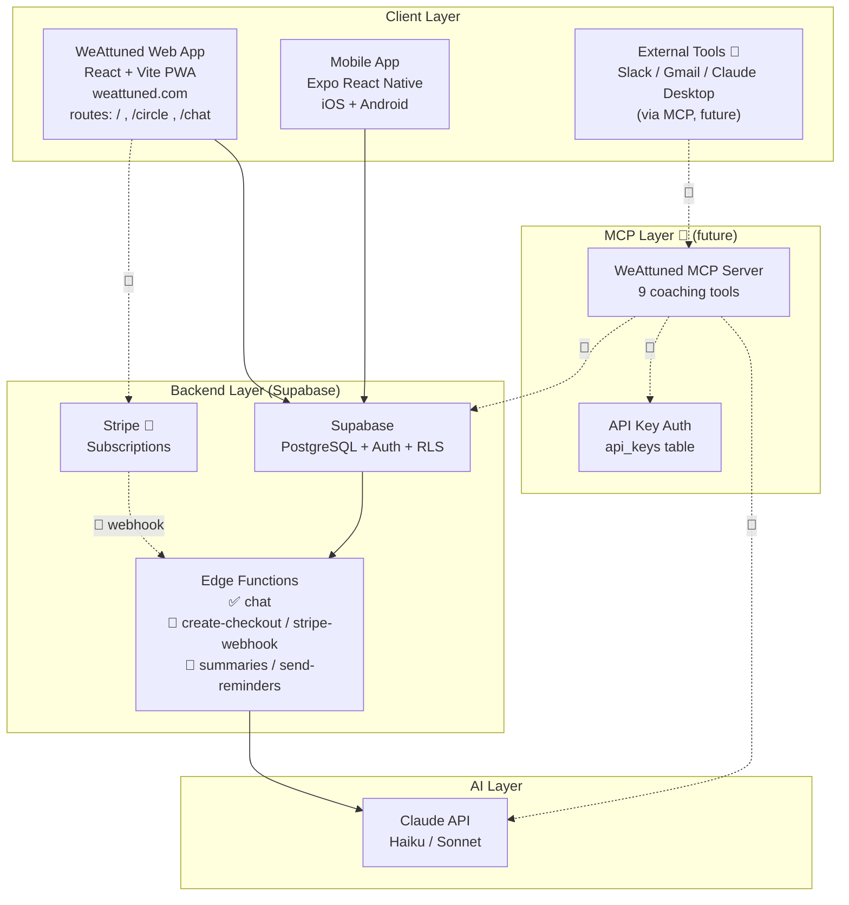
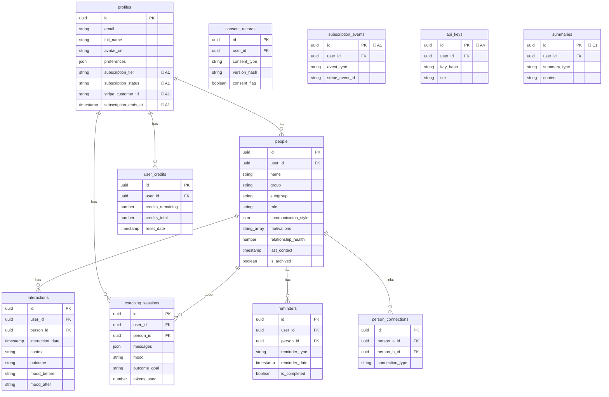

# WeAttuned — System Architecture

> **Status:** Living document. Update after every feature/structural change.
> **Last reconciled:** 2026-05-26 (full codebase audit).
> Legend: ✅ exists today · 🔲 planned (Phase 2).

---

## Section 1: System Architecture Diagram

---

## Section 2: Database Schema (current)

Tables that exist today (with RLS enabled). 🔲 marks columns/tables to be added in A1/A4/C1.

---

## Section 3: MCP Data Flow (future — Part B)

Deferred until Step 4. Sequence diagram retained in `PHASE2_PLAN.md` Section 3.

---

## Section 4: Feature Status

| Area | Feature | Status |
|------|---------|--------|
| App | Auth, Add Person, Chat + AI, voice, onboarding | ✅ |
| App | Person Profile modal (view/edit/archive/delete) | ✅ |
| App | Circle dashboard (groups, search, sort, health) | ✅ |
| App | Interaction logging + relationship health calc | ✅ |
| App | Reminders widget + create modal (UI) | ✅ |
| App | Connections, Summaries/Insights UI | ✅ |
| Compliance | Consent records + legal document versions | ✅ |
| **A1** | Stripe subscriptions (DB, edge fns, /me page, enforcement) | 🔄 in progress |
| **C1** | Smart summaries edge fn + Reflect page | 🔲 |
| **C2** | send-reminders edge fn (email digest) | 🔲 |
| **A4** | api_keys table + service + manager UI | 🔲 (MCP prereq) |
| **B** | MCP server (9 tools, auth, rate limit, deploy) | 🔲 |
| **D** | MCP pricing tiers + API key UI | 🔲 |

---

## Deployment
- **Web:** Vercel → weattuned.com
- **Backend:** Supabase (PostgreSQL + Auth + Edge Functions)
- **Mobile:** Expo (iOS + Android)
- **MCP:** 🔲 TBD (Railway vs Vercel vs Supabase Edge — decided at Step 4)
- **Repo:** github.com/itsmubinaraza-tech/attune_ai_my-circle_of_influence (`origin`)
