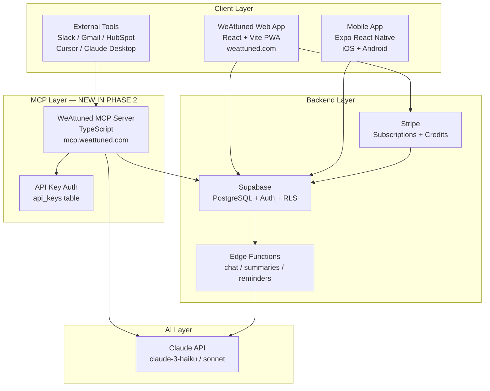
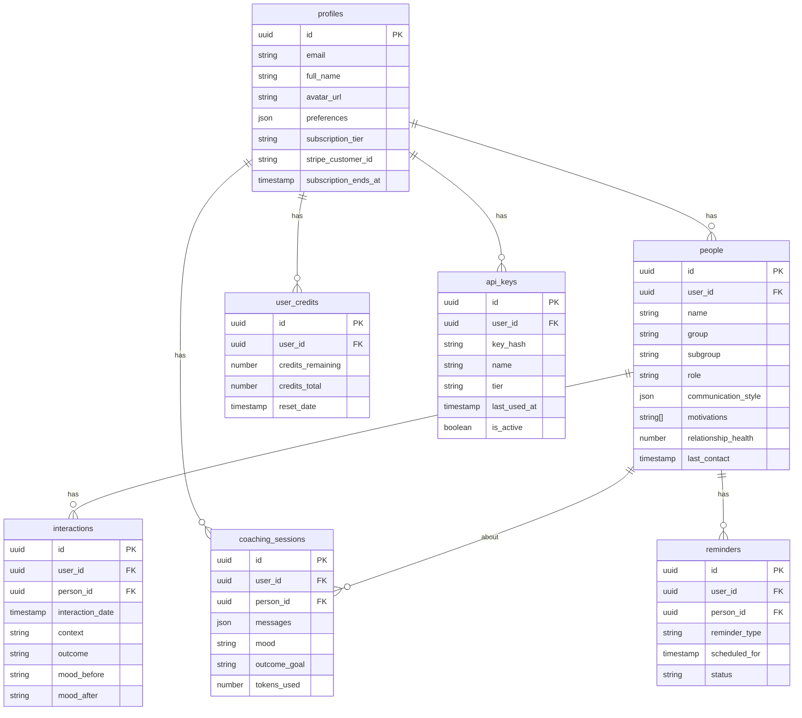
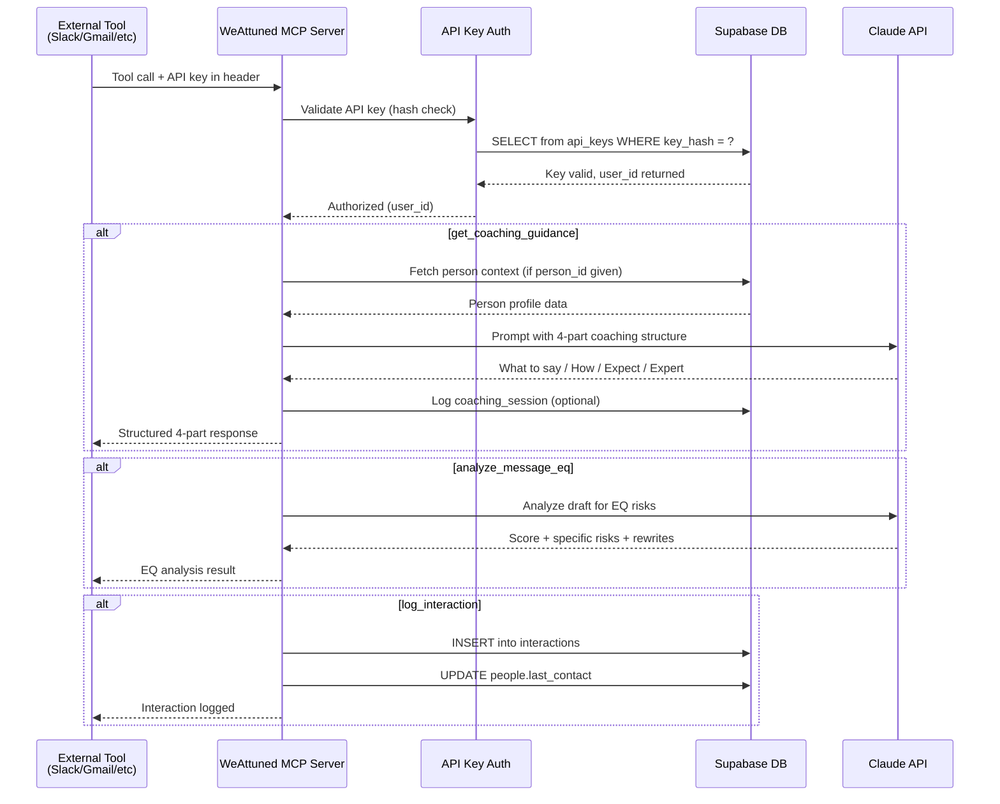

# WeAttuned — Phase 2 Master Plan
# MCP Server, Monetization & App Completion

> **Version:** 2.0 | **Created:** May 2026
> **Project:** WeAttuned (weattuned.com) — Attune AI
> **Scope:** Complete Phase 1 gaps + Build MCP Server + Stripe + Intelligence Layer
> **Methodology:** Interview-first → Plan → Build → Test → Diagram → Commit

---

## ⚡ STARTUP PROTOCOL (Run Every Session)

**Claude Code: Every time you start a new session, you MUST do the following in order:**

### Step 1 — Read context files
```
READ: PHASE2_PLAN.md          (this file — the master plan)
READ: progress_document.txt   (what's been done)
READ: ARCHITECTURE.md         (current system diagram — create if missing)
READ: CLAUDE.md               (project conventions and stack)
```

### Step 2 — Interview the user
Use the Ask User Tool to run this interview before writing any code.
Ask one question at a time. Wait for the answer before continuing.

**Required interview questions (ask ALL of these):**

```
QUESTION 1 (Context):
"Before we start, let me catch up. Which area do you want to focus on today?
  A) Complete missing app features (Profile view, Circle dashboard, Stripe)
  B) Build the MCP server
  C) Both — finish app first, then MCP
  D) Something specific (tell me what)"

QUESTION 2 (Technical tradeoffs — only if MCP is in scope):
"For the MCP server authentication, I have two options:
  A) Simple API keys (faster to build, good enough for launch)
  B) OAuth2 flow (more complex, better for enterprise clients)
Which fits your timeline and target customer better?"

QUESTION 3 (UI/UX — only if app features are in scope):
"For the Person Profile view, should it be:
  A) A slide-up modal (stays on current page, mobile-first)
  B) A full page route (better SEO, shareable URL)
  C) Match whatever the existing Circle page does"

QUESTION 4 (Stripe — only if monetization is in scope):
"For Stripe integration, which comes first?
  A) Subscription plans only (Free/Starter/Growth/Premium)
  B) Credit packs only (one-time purchases)
  C) Both at the same time"

QUESTION 5 (Deployment):
"Where should the MCP server live?
  A) Same Vercel project as the web app (simpler)
  B) Separate Railway deployment (better separation, easier to sell)
  C) As a new Supabase Edge Function (stays in existing infra)"
```

### Step 3 — Summarize and confirm
After the interview, write a 3-sentence summary of what you understood and ask:
*"Is this what we're building today? Say yes to start or correct me."*

### Step 4 — Update progress.txt
Add a session entry at the top of progress_document.txt:
```
SESSION: [date]
FOCUS: [what user said in interview]
STATUS: In progress
```

---

## 📐 ARCHITECTURE DIAGRAMS

> **CRITICAL RULE:** Every time you complete a feature or make a structural change,
> you MUST update ARCHITECTURE.md with the current state.
> Never let the diagram fall out of sync with the code.

### ARCHITECTURE.md — What to maintain

Claude Code must create and maintain `ARCHITECTURE.md` in the repo root.
It must contain ALL of the following sections, updated after every feature:

---

### Section 1: System Architecture Diagram



---

### Section 2: Database Schema Diagram



---

### Section 3: MCP Data Flow Diagram



---

### Section 4: Feature Status Table
*(Update this after every feature completion. Reconciled against a full codebase audit on 2026-05-26 — see RECONCILED BUILD SEQUENCE below.)*

| Feature | Status | Commit | Date |
|---------|--------|--------|------|
| Phase 1 Foundation | ✅ Complete | 7c52ff2 | Jan 31 |
| Phase 1 Auth | ✅ Complete | 7c69dd8 | Jan 31 |
| Phase 1 Supabase | ✅ Complete | a9d323d | Jan 31 |
| Phase 2.1 Add Person | ✅ Complete | a8888c9 | Jan 31 |
| Chat Interface | ✅ Complete | — | Feb 8 |
| Claude AI Integration | ✅ Complete | — | Feb 8 |
| Mobile Backend | ✅ Complete | — | Feb 7 |
| Google OAuth | ✅ Complete | — | Feb 9 |
| Consent / Legal compliance (bonus) | ✅ Complete | — | Feb 11 |
| **A2: Person Profile + Circle Dashboard** | ✅ Complete (audit) | — | pre-existing |
| **A3: Interaction Logging + Health** | ✅ Complete (audit) | — | pre-existing |
| **C2(UI): Reminders widget + modal** | ✅ Complete (audit) | — | pre-existing |
| **A1: Stripe (subscriptions)** | ✅ Code-complete (⏳ deploy) | 41f01e9..f44f621 | 2026-05-26 |
| **A4: API Keys Table** | 🔲 Not started (MCP prereq) | — | — |
| **B1: MCP Setup** | 🔲 Not started | — | — |
| **B2: Core MCP Tools** | 🔲 Not started | — | — |
| **B3: MCP Auth / Rate limiting** | 🔲 Not started | — | — |
| **B4: MCP Deploy** | 🔲 Not started | — | — |
| **C1: Smart Summaries + Reflect page** | 🔲 Not started | — | — |
| **C2: Reminder delivery (send-reminders fn)** | 🔲 Not started | — | — |
| **D1: MCP pricing + API key UI** | 🔲 Not started | — | — |

---

### RECONCILED BUILD SEQUENCE (added 2026-05-26)

A codebase audit found Part A's user-facing app (Person Profile, Circle, Interaction
logging, Reminders UI, Chat/AI) **already built** — the statuses above were stale.
Confirmed direction with the product owner:

**verify → A1 Stripe (subscriptions) → app gaps (C1, C2) → MCP (A4 + B + D) later**

Built one feature at a time; after each: run it, verify it meets requirements, emit a
Validation Card, update this table + `progress_document.txt`, then commit/push to `origin`.

**Locked decisions:**
- Subscriptions first; one-time credit packs are a later follow-on.
- Tiers: **Free = 10 msgs/mo**, Starter $4.99, Growth $9.99, Premium $19.99.
- Account/billing UI lives on a **new `/me` page** (also future home of API-key manager).
- **Hard constraint: the landing page (`src/pages/Index.tsx`, `src/components/landing/*`) must not change.**

What's genuinely missing (the real Phase 2 scope): A1 Stripe, A4 api_keys table/service/UI,
the `mcp/` server, the `summaries` + `send-reminders` edge functions, and a `Reflect` page.

---

## 🗺️ PHASE 2 BUILD ORDER

```
PART A: Complete the App (Foundation for MCP)
├── A1: Stripe Integration
├── A2: Person Profile View + Circle Dashboard
├── A3: Interaction Logging
└── A4: API Keys Table (MCP prerequisite)

PART B: The MCP Server
├── B1: Project Setup + Scaffolding
├── B2: Core Tools (9 tools)
├── B3: Authentication Layer (API keys)
├── B4: Rate Limiting + Usage Tracking
├── B5: Local Testing (MCP Inspector)
└── B6: Deployment (Railway)

PART C: Intelligence Layer
├── C1: Smart Summaries (Edge Function)
├── C2: Reminders System
└── C3: Analytics Dashboard

PART D: Monetization Completion
├── D1: MCP Pricing Tiers
└── D2: API Key Management UI
```

---

## PART A: Complete the App

---

### Feature A1: Stripe Integration
**Priority:** High — required before MCP monetization
**Files:** `src/services/stripe.ts`, `supabase/functions/stripe-webhook/index.ts`

#### What's missing (from PRICING_MODEL.md)
- Stripe products not created yet
- No checkout flow in UI
- No webhook handler for subscription events
- No subscription tier enforcement in credits system

#### Tasks
- [ ] Create Stripe products (Starter $4.99, Growth $9.99, Premium $19.99)
- [ ] Add `stripe_customer_id`, `subscription_tier`, `subscription_ends_at` to profiles table
- [ ] Build Supabase Edge Function: `stripe-webhook` (handles checkout, renewal, cancellation)
- [ ] Build `src/services/stripe.ts` — createCheckoutSession, getPortalUrl
- [ ] Add upgrade UI in `src/components/auth/UpgradePrompt.tsx`
- [ ] Add subscription status display in Profile page
- [ ] Enforce tier limits in chat (Haiku for free/starter, Sonnet for premium)
- [ ] Add credit pack one-time purchases

#### Database migration
```sql
-- Run in Supabase SQL Editor
ALTER TABLE profiles
  ADD COLUMN IF NOT EXISTS subscription_tier TEXT DEFAULT 'free',
  ADD COLUMN IF NOT EXISTS subscription_status TEXT DEFAULT 'active',
  ADD COLUMN IF NOT EXISTS stripe_customer_id TEXT UNIQUE,
  ADD COLUMN IF NOT EXISTS subscription_ends_at TIMESTAMPTZ;

CREATE TABLE IF NOT EXISTS subscription_events (
  id UUID PRIMARY KEY DEFAULT gen_random_uuid(),
  user_id UUID REFERENCES auth.users(id) ON DELETE CASCADE,
  event_type TEXT NOT NULL,
  stripe_event_id TEXT UNIQUE,
  tier TEXT,
  created_at TIMESTAMPTZ DEFAULT NOW()
);
```

#### Test Plan
```
TEST A1.1: Stripe checkout
- [ ] Clicking upgrade opens Stripe checkout
- [ ] Successful payment updates subscription_tier in DB
- [ ] Webhook fires and updates profile correctly
- [ ] User sees correct tier in UI after payment

TEST A1.2: Subscription enforcement
- [ ] Free users get 10 messages/month
- [ ] Starter users get 100 messages/month
- [ ] Premium users get unlimited + Sonnet model
- [ ] Downgrade correctly removes premium features

TEST A1.3: Credit packs
- [ ] One-time purchase adds credits
- [ ] Credits persist after monthly reset
- [ ] Credits display correctly in UI

TEST A1.4: Webhook reliability
- [ ] checkout.session.completed updates tier
- [ ] invoice.payment_failed shows warning in UI
- [ ] customer.subscription.deleted reverts to free
```

#### Validation steps for user
After running tests, confirm:
1. Go to app → click upgrade → complete Stripe test checkout (use card 4242 4242 4242 4242)
2. Check Supabase → profiles table → your row should show `subscription_tier = 'starter'`
3. Send 11 messages as free user → should see upgrade prompt
4. Check Stripe dashboard → subscription should appear

#### Commit message
```
feat(monetization): add Stripe subscriptions and credit packs

- Add Stripe checkout and portal flows
- Add stripe-webhook edge function
- Enforce tier limits in chat service
- Update Profile page with subscription status
- Add upgrade prompts at credit limits

Closes: Phase 2 / Feature A1
```

---

### Feature A2: Person Profile View + Circle Dashboard
**Priority:** High — core app UX
**Files:** `src/components/attune/PersonProfileModal.tsx`, `src/pages/Circle.tsx`

#### What's missing
- PersonProfileModal exists but is partially built (has mockPerson support but limited real data display)
- Circle.tsx needs full implementation of 2.3 from DEVELOPMENT_PLAN.md
- Connection web (2.4) not built

#### Tasks
- [ ] Complete PersonProfileModal:
  - [ ] Full data display (all Person fields)
  - [ ] Relationship health score with visual bar
  - [ ] Last contact date with "X days ago" display
  - [ ] Interaction history list (last 5)
  - [ ] Edit mode (inline edit, save to Supabase)
  - [ ] Archive / Delete with confirmation
  - [ ] "Talk to Attune about [Name]" CTA button
- [ ] Complete Circle.tsx:
  - [ ] People list grouped by Work / Family / Friends / Acquaintances
  - [ ] Person cards with health indicator
  - [ ] Search bar with real-time filter
  - [ ] Group expand/collapse
  - [ ] "Add Person" FAB
  - [ ] Empty state per group
- [ ] Add Connection Web (person_connections table):
  - [ ] "Connections" section on PersonProfileModal
  - [ ] Search + add connection UI
  - [ ] Display connections list

#### Test Plan
```
TEST A2.1: Person Profile
- [ ] All fields display correctly for a real person
- [ ] Edit mode works — changes persist after save
- [ ] Archive removes person from circle (but keeps in DB)
- [ ] Delete asks for confirmation, then removes
- [ ] "Talk to Attune" button opens chat with person pre-selected

TEST A2.2: Circle Dashboard
- [ ] All people appear in correct groups
- [ ] Search filters in real-time by name
- [ ] Group expand/collapse toggles work
- [ ] Clicking person opens PersonProfileModal
- [ ] Health indicators show correct colors (green/yellow/red)
- [ ] Empty group shows friendly CTA

TEST A2.3: Connections
- [ ] Can add connection between two people
- [ ] Connection type (knows/works_with/related_to) saves
- [ ] Connection appears on both people's profiles
- [ ] Can remove connection
```

#### Validation steps for user
1. Open Circle page → should see all your people in grouped sections
2. Click a person → profile modal opens with real data
3. Edit their notes → save → confirm change persisted
4. Add a connection between two people → confirm it shows on both profiles

#### Commit message
```
feat(people): complete Person Profile and Circle Dashboard

- Full PersonProfileModal with edit/archive/delete
- Complete Circle.tsx with search, groups, health indicators
- Connection web between people (person_connections)
- Interaction history on profile

Closes: Phase 2 / Feature A2
```

---

### Feature A3: Interaction Logging
**Priority:** Medium — feeds into MCP's log_interaction tool
**Files:** `src/components/attune/LogInteractionModal.tsx`, `src/services/interactions.ts`

#### What's missing
- `LogInteractionModal.tsx` exists but needs completion
- Interaction history not displayed on person profile
- `relationship_health` not auto-calculated from interactions

#### Tasks
- [ ] Complete `LogInteractionModal.tsx` with all fields
- [ ] Add interaction history list to PersonProfileModal
- [ ] Build `calculateRelationshipHealth()` function:
  - Recent successful interactions → increase health
  - Long gaps since last contact → decrease health
  - Unsuccessful outcomes → decrease health
- [ ] Auto-update `people.relationship_health` after each log
- [ ] Auto-update `people.last_contact` after each log
- [ ] Add "Log Interaction" button to person profile + chat

#### Test Plan
```
TEST A3.1: Logging
- [ ] Modal opens from profile and from chat
- [ ] All fields save correctly to interactions table
- [ ] last_contact updates on the person record
- [ ] relationship_health recalculates correctly

TEST A3.2: History display
- [ ] Recent interactions show on person profile
- [ ] Outcomes color-coded (green/yellow/red)
- [ ] Sorted by date, newest first

TEST A3.3: Health calculation
- [ ] 3 successful interactions → health increases
- [ ] 30 days no contact → health decreases
- [ ] Health score stays 0-100
```

#### Commit message
```
feat(interactions): complete interaction logging and relationship health

- Complete LogInteractionModal with all fields
- Auto-calculate relationship_health score
- Interaction history on PersonProfileModal
- Update last_contact on every log

Closes: Phase 2 / Feature A3
```

---

### Feature A4: API Keys Table
**Priority:** CRITICAL — must be done before any MCP work
**Files:** `supabase/migrations/[date]_api_keys.sql`, `src/services/apiKeys.ts`

#### Why this must come first
The MCP server authenticates with API keys, not user sessions.
Without this table, the MCP server cannot securely identify which user is making requests.

#### Tasks
- [ ] Run migration (SQL below)
- [ ] Create `src/services/apiKeys.ts` — generateKey, listKeys, revokeKey
- [ ] Create `src/components/attune/ApiKeysManager.tsx` — UI to create/view/revoke keys
- [ ] Add API Keys section to Profile page (behind login)
- [ ] Add key usage tracking (last_used_at, requests_count)

#### Database migration
```sql
-- supabase/migrations/[timestamp]_api_keys.sql

CREATE EXTENSION IF NOT EXISTS pgcrypto;

CREATE TABLE IF NOT EXISTS api_keys (
  id UUID PRIMARY KEY DEFAULT gen_random_uuid(),
  user_id UUID REFERENCES auth.users(id) ON DELETE CASCADE NOT NULL,
  -- Store SHA-256 hash of key, never the raw key
  key_hash TEXT NOT NULL UNIQUE,
  -- Friendly name: "My Slack Integration", "HubSpot CRM"
  name TEXT NOT NULL,
  -- Tier controls rate limits: 'free' | 'starter' | 'pro' | 'enterprise'
  tier TEXT NOT NULL DEFAULT 'starter',
  -- Usage tracking
  requests_count INTEGER DEFAULT 0,
  last_used_at TIMESTAMPTZ,
  -- Metadata
  created_at TIMESTAMPTZ DEFAULT NOW(),
  is_active BOOLEAN DEFAULT TRUE,
  -- Optional: restrict to specific tools
  allowed_tools TEXT[] DEFAULT NULL
);

-- RLS: users can only see their own keys
ALTER TABLE api_keys ENABLE ROW LEVEL SECURITY;

CREATE POLICY "Users can view own api_keys"
  ON api_keys FOR SELECT
  USING (auth.uid() = user_id);

CREATE POLICY "Users can insert own api_keys"
  ON api_keys FOR INSERT
  WITH CHECK (auth.uid() = user_id);

CREATE POLICY "Users can update own api_keys"
  ON api_keys FOR UPDATE
  USING (auth.uid() = user_id);

CREATE POLICY "Users can delete own api_keys"
  ON api_keys FOR DELETE
  USING (auth.uid() = user_id);

-- Index for fast key lookups (MCP server does this on every request)
CREATE INDEX idx_api_keys_hash ON api_keys(key_hash) WHERE is_active = TRUE;
CREATE INDEX idx_api_keys_user ON api_keys(user_id);
```

#### Key generation logic (in apiKeys.ts)
```typescript
import { createHash, randomBytes } from 'crypto';

// Generate a new API key
export function generateApiKey(): { raw: string; hash: string } {
  // Format: weattuned_[32 random bytes as hex]
  const raw = `weattuned_${randomBytes(32).toString('hex')}`;
  const hash = createHash('sha256').update(raw).digest('hex');
  return { raw, hash };
}

// IMPORTANT: raw key is shown to user ONCE then discarded
// Only hash is stored in database
```

#### Test Plan
```
TEST A4.1: Key creation
- [ ] Clicking "Create API Key" generates a new key
- [ ] Raw key shown ONCE with "copy" button and warning
- [ ] Only hash stored in database (verify in Supabase dashboard)
- [ ] Key appears in keys list after creation

TEST A4.2: Key validation
- [ ] Valid key returns correct user_id
- [ ] Invalid/expired key returns 401
- [ ] Revoked key returns 401
- [ ] Key hash matches stored hash

TEST A4.3: Key management
- [ ] Can create multiple keys with different names
- [ ] Can revoke (soft delete) a key
- [ ] Revoked key immediately stops working
- [ ] last_used_at updates on each use
```

#### Validation steps for user
1. Go to Profile page → find "API Keys" section
2. Click "Create New Key" → name it "Test Key"
3. Copy the raw key (it starts with `weattuned_`)
4. Go to Supabase dashboard → api_keys table → confirm ONLY the hash is stored (not the raw key)
5. Keep this key — you'll need it to test the MCP server

#### Commit message
```
feat(api-keys): add API key system for MCP authentication

- Add api_keys table with RLS policies
- Key generation with SHA-256 hashing (raw key never stored)
- ApiKeysManager UI component
- Key revocation and usage tracking

Closes: Phase 2 / Feature A4
```

---

## PART B: The MCP Server

---

### Feature B1: MCP Server Project Setup
**Priority:** Critical
**Location:** `mcp/` folder inside the existing repo (or separate repo)

#### Decision point (ask user in interview)
The MCP server lives at `mcp/` inside the existing repo for simplicity.
If user wants a separate repo, create `weattuned-mcp` as a new GitHub repo.

#### Project structure
```
mcp/
├── src/
│   ├── index.ts              ← MCP server entry point
│   ├── auth.ts               ← API key validation
│   ├── tools/
│   │   ├── getCoachingGuidance.ts
│   │   ├── getPeople.ts
│   │   ├── getPersonContext.ts
│   │   ├── logInteraction.ts
│   │   ├── analyzeMessageEq.ts
│   │   ├── rewriteForEq.ts
│   │   ├── getRelationshipInsights.ts
│   │   ├── createReminder.ts
│   │   └── flagCommunicationRisk.ts
│   ├── supabase.ts           ← Supabase client for MCP
│   ├── claude.ts             ← Claude API caller
│   └── types.ts              ← Shared types
├── .env.example
├── package.json
├── tsconfig.json
└── README.md
```

#### Tasks
- [ ] Create `mcp/` directory
- [ ] Run: `npm init -y && npm install @modelcontextprotocol/sdk zod @supabase/supabase-js`
- [ ] Run: `npm install -D typescript @types/node ts-node`
- [ ] Create `tsconfig.json`
- [ ] Create `src/index.ts` — base MCP server with no tools yet
- [ ] Create `src/auth.ts` — API key validation against Supabase
- [ ] Create `src/supabase.ts` — Supabase admin client
- [ ] Create `src/claude.ts` — Claude API wrapper with 4-part prompt
- [ ] Create `.env.example`
- [ ] Verify: `npx @modelcontextprotocol/inspector node dist/index.js` shows server with 0 tools

#### Environment variables needed
```bash
# mcp/.env
SUPABASE_URL=your_supabase_url
SUPABASE_SERVICE_ROLE_KEY=your_service_role_key  # NOT anon key — needs to bypass RLS
ANTHROPIC_API_KEY=your_claude_key
PORT=3000
```

#### Test Plan
```
TEST B1.1: Server starts
- [ ] npm run build compiles without errors
- [ ] node dist/index.js starts without errors
- [ ] MCP Inspector connects and shows server name "weattuned"
- [ ] Server responds to ping

TEST B1.2: Auth works
- [ ] Valid API key returns user_id
- [ ] Invalid API key returns 401 with clear message
- [ ] Missing API key returns 401
- [ ] Revoked key returns 401
```

#### Commit message
```
feat(mcp): scaffold MCP server with auth layer

- Create mcp/ project directory
- Base MCP server with @modelcontextprotocol/sdk
- API key authentication against Supabase api_keys table
- Claude API wrapper with 4-part coaching prompt
- Zero tools registered (B2 adds them)

Closes: Phase 2 / Feature B1
```

---

### Feature B2: Core MCP Tools (9 tools)
**Priority:** Critical — this is the product
**Files:** `mcp/src/tools/*.ts`

#### The 9 tools — exact specifications

---

#### Tool 1: `get_coaching_guidance`
The core product. Returns the 4-part response.

```typescript
// Input
{
  situation: string,           // Required: describe what's happening
  person_type: string,         // Required: boss | colleague | partner | parent | friend | difficult
  person_id?: string,          // Optional: UUID — if provided, loads full profile from DB
  mood?: string,               // Optional: user's current mood
  outcome_goal?: string,       // Optional: resolve | connect | understand | express | support | boundaries
}

// Output
{
  what_to_say: {
    opening: string,
    key_phrases: string[],
    full_script: string,
  },
  how_to_say_it: {
    tone: string,
    timing: string,
    setting: string,
    tips: string[],
  },
  what_to_expect: {
    most_likely: string,
    best_case: string,
    challenging_case: string,
    follow_up: string,
  },
  expert_insight: {
    principle: string,
    expert: string,
    insight: string,
    actionable: string,
  },
  person_context_used: boolean,
  coaching_session_id?: string,
}
```

---

#### Tool 2: `get_people`
Returns user's circle of influence.

```typescript
// Input
{
  group?: 'work' | 'family' | 'friends' | 'acquaintances', // filter by group
  include_archived?: boolean,  // default false
  limit?: number,              // default 20, max 100
}

// Output
{
  people: Array<{
    id: string,
    name: string,
    group: string,
    subgroup?: string,
    role?: string,
    relationship_health?: number,
    last_contact?: string,
  }>,
  total: number,
}
```

---

#### Tool 3: `get_person_context`
Returns full profile for one person.

```typescript
// Input
{ person_id: string }  // UUID

// Output
{
  id: string,
  name: string,
  group: string,
  subgroup?: string,
  role?: string,
  communication_style?: object,
  motivations?: string[],
  values?: string[],
  goals?: string[],
  notes?: string,
  relationship_health?: number,
  last_contact?: string,
  recent_interactions?: Array<{
    date: string,
    outcome: string,
    context: string,
  }>,
}
```

---

#### Tool 4: `log_interaction`
Saves a conversation outcome to the database.

```typescript
// Input
{
  person_id: string,
  context: string,             // what happened
  outcome: 'successful' | 'partial' | 'unsuccessful',
  what_worked?: string,
  what_didnt_work?: string,
  mood_before?: string,
  mood_after?: string,
  interaction_date?: string,   // ISO date, defaults to now
}

// Output
{
  interaction_id: string,
  relationship_health_updated: boolean,
  new_relationship_health?: number,
}
```

---

#### Tool 5: `analyze_message_eq`
Scores a draft message for emotional intelligence.

```typescript
// Input
{
  draft_message: string,
  person_id?: string,          // loads their profile for context
  person_type?: string,        // boss | colleague | partner etc.
  relationship_context?: string,
}

// Output
{
  eq_score: number,            // 0-100
  risks: Array<{
    type: string,              // 'defensive_trigger' | 'tone' | 'timing' | 'word_choice'
    description: string,
    suggestion: string,
  }>,
  strengths: string[],
  overall_assessment: string,
  ready_to_send: boolean,
}
```

---

#### Tool 6: `rewrite_for_eq`
Rewrites a message with emotional intelligence applied.

```typescript
// Input
{
  draft_message: string,
  tone_goal: 'collaborative' | 'assertive' | 'empathetic' | 'professional' | 'warm',
  person_id?: string,
  preserve_intent?: boolean,   // default true
}

// Output
{
  rewritten_message: string,
  changes_made: string[],
  tone_achieved: string,
  eq_score_before: number,
  eq_score_after: number,
}
```

---

#### Tool 7: `get_relationship_insights`
AI-generated summary of relationship health for one person.

```typescript
// Input
{
  person_id: string,
  include_recommendations?: boolean,  // default true
}

// Output
{
  person_name: string,
  relationship_health: number,
  health_trend: 'improving' | 'stable' | 'declining',
  summary: string,
  strengths: string[],
  areas_to_improve: string[],
  recommendations: Array<{
    action: string,
    urgency: 'high' | 'medium' | 'low',
    expected_impact: string,
  }>,
  last_interaction_summary?: string,
}
```

---

#### Tool 8: `create_reminder`
Sets a smart nudge for maintaining a relationship.

```typescript
// Input
{
  person_id: string,
  title: string,
  reminder_type: 'one_time' | 'recurring' | 'smart_nudge',
  scheduled_for: string,       // ISO datetime
  frequency?: 'daily' | 'weekly' | 'biweekly' | 'monthly' | 'quarterly',
  message?: string,
}

// Output
{
  reminder_id: string,
  person_name: string,
  scheduled_for: string,
  confirmation: string,
}
```

---

#### Tool 9: `flag_communication_risk`
Quick check: will this message land badly?

```typescript
// Input
{
  message: string,
  person_type?: string,
  relationship_context?: string,
}

// Output
{
  risk_level: 'low' | 'medium' | 'high',
  flags: Array<{
    issue: string,
    explanation: string,
  }>,
  safe_to_send: boolean,
  quick_fix?: string,         // one-sentence fix if risk is high
}
```

---

#### Test Plan for all 9 tools
```
TEST B2.1: Tool registration
- [ ] All 9 tools appear in MCP Inspector
- [ ] Each tool has correct input schema
- [ ] Each tool has meaningful description

TEST B2.2: get_coaching_guidance
- [ ] Returns all 4 sections (what/how/expect/expert)
- [ ] With person_id: uses their name and notes in response
- [ ] Without person_id: uses generic person_type
- [ ] JSON is valid and structured correctly

TEST B2.3: get_people / get_person_context
- [ ] Returns real data from Supabase for authenticated user
- [ ] Group filter works
- [ ] Returns 404-style error for invalid person_id
- [ ] Does NOT return another user's people (RLS equivalent check)

TEST B2.4: log_interaction
- [ ] Interaction saves to database
- [ ] last_contact updates on person record
- [ ] relationship_health recalculates
- [ ] Returns the new interaction_id

TEST B2.5: EQ tools (analyze, rewrite, flag)
- [ ] analyze_message_eq returns score 0-100
- [ ] rewrite_for_eq returns improved message
- [ ] flag_communication_risk correctly identifies "you always" language as high risk
- [ ] All handle empty/short messages gracefully

TEST B2.6: Security
- [ ] Cannot access another user's people or sessions
- [ ] person_id that belongs to another user returns error
- [ ] All tools require valid API key
```

#### Validation steps for user
For each tool:
1. Open MCP Inspector (`npx @modelcontextprotocol/inspector node dist/index.js`)
2. Click the tool name
3. Fill in the inputs shown
4. Click "Run Tool"
5. Verify the output looks correct
6. Check Supabase to confirm DB writes happened (for log_interaction, create_reminder)

#### Commit message
```
feat(mcp): implement all 9 WeAttuned MCP tools

Tools added:
- get_coaching_guidance (4-part response, person context aware)
- get_people + get_person_context (circle of influence access)
- log_interaction (saves to DB, updates health score)
- analyze_message_eq + rewrite_for_eq (EQ scoring + rewrite)
- get_relationship_insights (AI summary)
- create_reminder (smart nudges)
- flag_communication_risk (quick risk check)

All tools: validated input with Zod, proper error messages, RLS-equivalent
security check on user_id scope

Closes: Phase 2 / Feature B2
```

---

### Feature B3: Rate Limiting + Usage Tracking
**Priority:** High — required before going live
**Files:** `mcp/src/rateLimit.ts`, `mcp/src/usageTracking.ts`

#### Tasks
- [ ] Implement per-API-key rate limiting:
  - Starter tier: 100 requests/day, 10 requests/minute
  - Pro tier: 1000 requests/day, 60 requests/minute
  - Enterprise tier: unlimited
- [ ] Track usage in `api_keys` table (requests_count, last_used_at)
- [ ] Return rate limit headers: `X-RateLimit-Remaining`, `X-RateLimit-Reset`
- [ ] Implement usage log table for billing (optional — ask user)

#### Test Plan
```
TEST B3.1: Rate limiting
- [ ] 11th request in 1 minute on starter returns 429
- [ ] Rate limit headers present on all responses
- [ ] Different API keys have independent limits
- [ ] Enterprise key has no limit

TEST B3.2: Usage tracking
- [ ] requests_count increments on each call
- [ ] last_used_at updates on each call
- [ ] Usage visible in API Keys manager UI
```

#### Commit message
```
feat(mcp): add rate limiting and usage tracking

- Per-tier rate limits (100/day starter, 1000/day pro)
- Request counting and last_used_at tracking
- Rate limit headers on all responses

Closes: Phase 2 / Feature B3
```

---

### Feature B4: MCP Local Testing + README
**Priority:** High

#### Tasks
- [ ] Test all 9 tools with MCP Inspector
- [ ] Test with Claude Desktop (add to claude_desktop_config.json)
- [ ] Test with Cursor (add to .cursor/mcp.json)
- [ ] Write `mcp/README.md` for client setup
- [ ] Write `mcp/TOOLS.md` — full tool reference

#### Claude Desktop config
```json
{
  "mcpServers": {
    "weattuned": {
      "command": "node",
      "args": ["/path/to/repo/mcp/dist/index.js"],
      "env": {
        "SUPABASE_URL": "your_url",
        "SUPABASE_SERVICE_ROLE_KEY": "your_key",
        "ANTHROPIC_API_KEY": "your_key",
        "WEATTUNED_API_KEY": "weattuned_your_api_key_here"
      }
    }
  }
}
```

#### Validation steps for user
1. Add config to Claude Desktop
2. Restart Claude Desktop
3. Open a new conversation
4. Ask Claude: "Using my Weattuned circle, who should I reach out to this week?"
5. Claude should call `get_people`, then `get_relationship_insights` for those with low health
6. Confirm the response uses real data from your circle

#### Commit message
```
docs(mcp): complete testing and client setup documentation

- Verified all 9 tools with MCP Inspector
- Claude Desktop and Cursor integration tested
- README with quickstart guide
- TOOLS.md with full parameter reference

Closes: Phase 2 / Feature B4
```

---

### Feature B5: MCP Deployment to Railway
**Priority:** High — required for selling to clients

#### Tasks
- [ ] Create `mcp/railway.json` or `mcp/Procfile`
- [ ] Set environment variables in Railway dashboard
- [ ] Deploy: Railway → New Project → GitHub → select mcp/ folder
- [ ] Get live URL: `https://weattuned-mcp.railway.app`
- [ ] Test live URL with MCP Inspector (remote mode)
- [ ] Update ARCHITECTURE.md with deployment URL

#### Remote MCP config (for clients)
```json
{
  "mcpServers": {
    "weattuned": {
      "url": "https://weattuned-mcp.railway.app/mcp",
      "headers": {
        "x-api-key": "weattuned_their_api_key_here"
      }
    }
  }
}
```

#### Test Plan
```
TEST B5.1: Remote server
- [ ] Railway URL responds to health check
- [ ] MCP Inspector connects to remote URL
- [ ] All 9 tools accessible remotely
- [ ] API key auth works over HTTPS

TEST B5.2: Performance
- [ ] get_coaching_guidance responds in < 8 seconds
- [ ] get_people responds in < 500ms
- [ ] No cold start issues (Railway always-on)
```

#### Commit message
```
deploy(mcp): production deployment to Railway

- Railway configuration for mcp/ subdirectory
- Environment variables documented
- Live URL: weattuned-mcp.railway.app
- Remote MCP config documented for clients

Closes: Phase 2 / Feature B5
```

---

## PART C: Intelligence Layer

---

### Feature C1: Smart Summaries
**Priority:** Medium
**Files:** `supabase/functions/summaries/index.ts`, `src/pages/Reflect.tsx`

#### Tasks
- [ ] Create `summaries` Edge Function:
  - Weekly summary: top patterns in coaching sessions
  - Per-person summary: relationship journey, growth areas
- [ ] Store summaries in new `summaries` table
- [ ] Display on Reflect page (currently stub)
- [ ] Trigger: weekly via Supabase cron OR on-demand

#### Database migration
```sql
CREATE TABLE summaries (
  id UUID PRIMARY KEY DEFAULT gen_random_uuid(),
  user_id UUID REFERENCES auth.users(id) ON DELETE CASCADE,
  summary_type TEXT NOT NULL,  -- 'weekly' | 'person'
  person_id UUID REFERENCES people(id),
  content TEXT NOT NULL,
  period_start DATE,
  period_end DATE,
  created_at TIMESTAMPTZ DEFAULT NOW()
);
```

#### Test Plan
```
TEST C1.1: Summary generation
- [ ] Weekly summary generates for user with 5+ sessions
- [ ] Person summary generates correctly
- [ ] Empty state handled (< 3 sessions)
- [ ] Summary content is helpful and accurate

TEST C1.2: Reflect page
- [ ] Summaries display on Reflect page
- [ ] Can generate on-demand
- [ ] Summaries update when new sessions added
```

#### Commit message
```
feat(intelligence): add smart summaries to Reflect page

- Summaries edge function (weekly + per-person)
- Reflect page with summary cards
- On-demand generation

Closes: Phase 2 / Feature C1
```

---

### Feature C2: Reminders System
**Priority:** Medium
**Files:** `src/components/attune/RemindersWidget.tsx`, `supabase/functions/send-reminders/index.ts`

#### Tasks (reminders table already exists — needs UI + trigger)
- [ ] Complete `RemindersWidget.tsx` (exists but needs finishing)
- [ ] Complete `CreateReminderModal.tsx`
- [ ] Add reminders display to home/Today page
- [ ] Build `send-reminders` Edge Function for email digest
- [ ] Smart nudge generation: flag people with health < 40 or last contact > 30 days

#### Test Plan
```
TEST C2.1: Create reminder
- [ ] Can create reminder for any person
- [ ] One-time and recurring types work
- [ ] Smart nudge generates automatically

TEST C2.2: Display
- [ ] Due reminders appear on home page
- [ ] Can dismiss/complete reminders
- [ ] Overdue reminders shown in red

TEST C2.3: Email digest (if implemented)
- [ ] Weekly email sends with pending reminders
- [ ] Unsubscribe link works
```

#### Commit message
```
feat(reminders): complete reminders system and smart nudges

- CreateReminderModal with all reminder types
- RemindersWidget on home page
- Smart nudge generation for neglected relationships
- Email digest edge function

Closes: Phase 2 / Feature C2
```

---

## PART D: Monetization Completion

---

### Feature D1: API Key Management UI + MCP Pricing
**Priority:** High — needed to actually sell MCP access

#### Tasks
- [ ] Complete `ApiKeysManager.tsx` component in Profile page
- [ ] Show usage stats per key (requests this month, last used)
- [ ] Add MCP pricing tiers to Stripe:
  - MCP Starter: $49/month (100 calls/day)
  - MCP Pro: $299/month (1,000 calls/day)
  - MCP Enterprise: contact sales
- [ ] Add upgrade flow for MCP tiers
- [ ] Landing page section for MCP server (on weattuned.com)

#### Test Plan
```
TEST D1.1: Key management
- [ ] Can create up to 3 keys (limit per tier)
- [ ] Can rename keys
- [ ] Can revoke keys (key stops working immediately)
- [ ] Usage stats display correctly

TEST D1.2: MCP pricing
- [ ] MCP plans appear in upgrade flow
- [ ] Stripe checkout for MCP tier works
- [ ] Rate limits update after plan upgrade
```

#### Commit message
```
feat(monetization): complete API key management and MCP pricing

- ApiKeysManager UI in Profile page
- Usage statistics per key
- MCP pricing tiers in Stripe
- Landing page MCP section

Closes: Phase 2 / Feature D1
```

---

## 📋 PROGRESS TRACKING RULES

### After every feature, Claude Code MUST:

1. **Update progress_document.txt** with this format:
```
--------------------------------------------------------------------------------
Feature [ID]: [Name]
--------------------------------------------------------------------------------
Completed: [date]
Commit: [hash]

Tasks Completed:
[X] Each task that was done

Test Results:
- TEST X.X.1: [name] - PASS/FAIL
  Notes: [any issues]

Issues Encountered:
[any blockers or unexpected problems]

Architecture Changes:
[yes/no — if yes, ARCHITECTURE.md was updated]
--------------------------------------------------------------------------------
```

2. **Update ARCHITECTURE.md** — specifically the Feature Status Table
   and any diagram that changed

3. **Commit to GitHub** with the commit message specified above

4. **Tell the user** what was just completed and what comes next,
   with a one-line validation instruction ("Go to X and do Y to confirm it works")

---

## 🔍 VALIDATION PROTOCOL

Every feature has user-validation steps. Claude Code should:

1. After completing a feature, output a **VALIDATION CARD**:

```
╔══════════════════════════════════════════════════════╗
║  VALIDATION: Feature [ID] — [Name]                   ║
╠══════════════════════════════════════════════════════╣
║  Please do these steps to confirm it works:          ║
║                                                      ║
║  1. [specific action]                                ║
║  2. [what to look for]                               ║
║  3. [what to check in Supabase/Stripe/etc]           ║
║                                                      ║
║  Expected result: [what success looks like]          ║
║  If it fails: [what to tell Claude Code]             ║
╚══════════════════════════════════════════════════════╝
```

2. Wait for user confirmation before moving to the next feature
3. If user reports a failure, fix before proceeding

---

## 🚦 DECISION LOG

Claude Code must document every significant decision here AND in progress_document.txt.

Format:
```
DATE: [date]
DECISION: [what was decided]
OPTIONS CONSIDERED: [A] vs [B] vs [C]
CHOSEN: [which option]
REASON: [why]
IMPACT: [what this affects]
```

---

## 📊 PHASE 2 SUCCESS METRICS

Phase 2 is complete when ALL of the following are true:

**App completion:**
- [ ] Person profiles fully editable with all fields
- [ ] Circle dashboard loads all people with search/filter
- [ ] Interaction logging works and updates health scores
- [ ] Stripe subscriptions live and enforced

**MCP server:**
- [ ] All 9 tools tested and passing in MCP Inspector
- [ ] API key auth working (valid key → data, invalid → 401)
- [ ] Deployed live at a public URL
- [ ] Successfully connected to Claude Desktop and shown real data
- [ ] Rate limiting preventing abuse

**Documentation:**
- [ ] ARCHITECTURE.md current and accurate
- [ ] progress_document.txt updated after every feature
- [ ] mcp/README.md complete enough for a developer to self-install
- [ ] TOOLS.md documents all 9 tools with examples

---

## 🆘 IF YOU GET STUCK

If Claude Code hits a blocker, do NOT skip ahead. Instead:

1. Document the blocker in progress_document.txt under "BLOCKERS"
2. Use Ask User Tool to describe the problem and present 2-3 options
3. Wait for the user's decision
4. Document the decision in the DECISION LOG

Common blockers and fixes:
- **Supabase RLS blocking MCP**: Use service_role key (not anon key) in MCP .env
- **CORS errors on MCP server**: Add `Access-Control-Allow-Origin: *` headers
- **TypeScript compile errors**: Ask user to run `npm run build` and paste the full error
- **Railway deploy fails**: Check that `mcp/package.json` has a `start` script

---

*Phase 2 Plan — WeAttuned / Attune AI*
*Generated: May 2026*
*Based on full codebase review of github.com/itsmubinaraza-tech/attune_ai_my-circle_of_influence*
